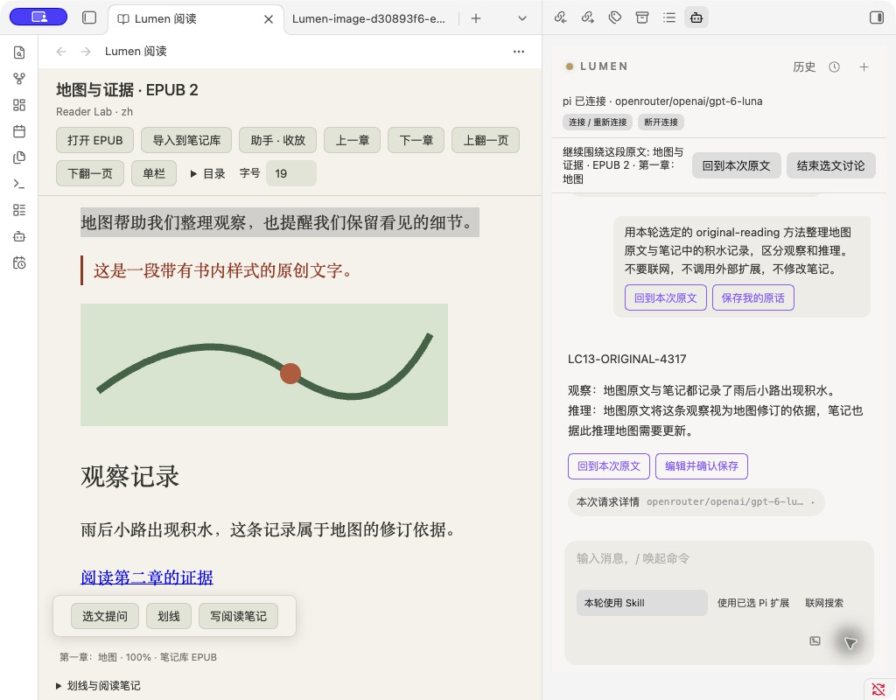
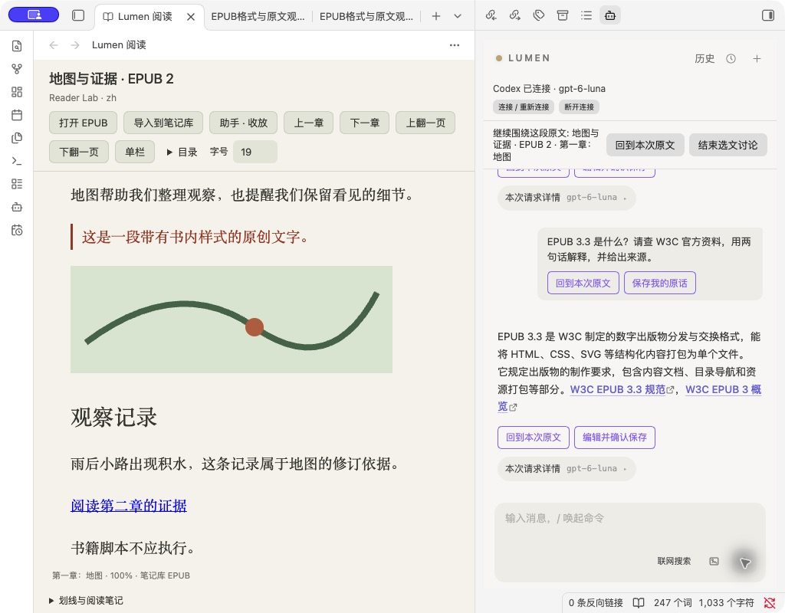

---
tags:
  - obsidian-plugin
  - ai-assistant
  - agentic-workflow
  - digital-employee
  - second-brain
---
# Lumen Pro (v5.8.0-pro): EPUB Reading, Skills & Native Images

[English Version Below](#english-version) | [中文版往下看](#中文版) 

## 5.8.0-pro · Selected Skills, Pi extensions & native images / 所选技能、扩展与原生生图

Read, ask, search and save in one Obsidian workspace. Select a trusted Codex/Pi instruction Skill for a message, use a compatible selected Pi tool extension, or explicitly ask Codex to generate an image. Preview and edit the image note before confirming it into your Vault. New capabilities default to off; one-turn selections reset after sending. A foreground CLI window is not required.

在同一个 Obsidian 界面读书、提问、查资料并保存理解。本版可以为一条消息选择可信的 Codex/Pi 指令型 Skill、使用兼容的已选 Pi 工具扩展，或明确要求 Codex 原生生图。图片先预览，编辑并确认后才存入笔记库。新能力默认关闭，本轮选择发送后复位；不必前台打开 CLI 窗口。

[Download / 下载](https://github.com/leoyang1984/lumen-public/releases/tag/v5.8.0-pro) · [Guide / 中英文指南](docs/READING_GUIDE.md) · [Changes / 中英文更新说明](docs/RELEASE_NOTES_5.8.0-pro.md)

Tested with macOS, Obsidian 1.14.4, Codex CLI 0.160.1 and Pi 1.1.0. Use installed, configured, signed-in CLIs and a model/account with the requested capability. Pi search needs a compatible extension. Self-contained instruction Skills are supported first. Pi extensions run trusted local code, **not a sandbox**; direct extension writes may bypass Lumen note confirmation. Terminal-only UI, complex Skills, arbitrary extensions and other OS/device combinations are not certified.

实测 macOS、Obsidian 1.14.4、Codex CLI 0.160.1 与 Pi 1.1.0。需要已安装、配置并登录的 CLI，以及支持相应能力的模型/账号。Pi 搜索另需兼容扩展；Skill 首批支持独立纯指令方法。Pi 扩展运行可信本机代码，**不是沙箱**，扩展自行写文件不保证经过 Lumen 笔记确认。纯终端界面、复杂 Skill、任意第三方扩展及其他系统/设备未认证。

Upgrade: replace only `main.js`, `manifest.json`, `styles.css`, preserving settings, reading state and history. / 升级仅替换三个运行文件，保留设置、阅读状态及历史。

## 5.7.0-pro · Web search while reading / 阅读中联网搜索

Read EPUBs, discuss selected passages and confirm source-linked notes in Obsidian. Now you can ask local Codex to search the web without leaving the reading workspace. Enable Web search in Lumen settings, then select the one-message search button or explicitly ask to search online. Ordinary follow-ups do not search again. Web sources remain separate from book/Vault sources and survive history export and restart.

在 Obsidian 中阅读 EPUB、讨论选文并确认保存带出处的笔记。现在可以在阅读界面中让本机 Codex 联网查资料。先在 Lumen 设置中开启“联网搜索”，再点击只授权一条消息的搜索按钮，或明确要求联网查阅。普通追问不继续联网；网页来源与书籍、笔记来源分开展示，历史导出和重启后仍保留。

[Download / 下载](https://github.com/leoyang1984/lumen-public/releases/tag/v5.7.0-pro) · [Guide / 中英文指南](docs/READING_GUIDE.md) · [Changes / 中英文更新说明](docs/RELEASE_NOTES_5.7.0-pro.md)

Requires desktop Obsidian and an installed, configured, signed-in Codex CLI with a search-capable model/account. No foreground CLI window is needed. Tested: macOS, Obsidian 1.14.4, Codex 0.160.1, gpt-6-luna. Search defaults to off; stopping or disabling it cancels the local request. Disabled requests keep the unsent text. Note changes still require preview and confirmation. / 需要桌面 Obsidian，以及已安装、配置并登录的 Codex CLI，模型和账号支持搜索；CLI 不必在前台打开。已实测 macOS、Obsidian 1.14.4、Codex 0.160.1、gpt-6-luna。搜索默认关闭，停止或关闭开关会取消本机请求；搜索未启用时保留问题文字；笔记改动仍需预览确认。

Also fixes source links opening an old chapter after restart. Pi extensions, selected Codex/Pi Skills and native Codex image generation are planned for LC-12–14; this release does not include their user-facing integration. Existing API image features retain their setup. Windows/Linux and physical mobile search remain unverified. / 同时修复重开后笔记回跳可能停在旧章节的问题。Pi 扩展、Codex/Pi 所选 Skill 与 Codex 原生生图的界面接入留在 LC-12～14，本版尚未提供；现有 API 生图沿用原设置。Windows/Linux 与实体移动端搜索未实机验证。

Upgrade by replacing only `main.js`, `manifest.json`, `styles.css`; preserve `data.json`, reading state and history. / 升级仅替换三个运行文件，保留配置、阅读状态及历史。

## 5.6.0-pro · EPUB Reading / EPUB 阅读

Read DRM-free, reflowable EPUBs inside Obsidian. Choose single/two columns, ask Codex/pi/API about a selection, confirm Markdown notes and return to the source. Reading works offline. Chat uses your configured model service. Local CLI windows need not remain open.

在 Obsidian 内读无 DRM、可重排 EPUB。单栏／双栏、选文向 Codex/pi/API 提问、确认保存笔记、点击引用回到原文。离线可以阅读；问答使用已配置的模型服务，本机 CLI 不必在前台打开。

[Download / 下载](https://github.com/leoyang1984/lumen-public/releases/tag/v5.6.0-pro) · [Guide / 中英文阅读指南](docs/READING_GUIDE.md) · [Changes / 中英文更新说明](docs/RELEASE_NOTES_5.6.0-pro.md)

Actual acceptance: macOS + Obsidian 1.14.4, Codex CLI 0.160.1 / pi 1.1.0. Other operating systems, physical mobile devices and live API provider matrices remain unverified. Fixed-layout and DRM books are outside this release. / 实际验收：macOS + Obsidian 1.14.4，Codex CLI 0.160.1 / pi 1.1.0；其他系统、实体移动设备及真实 API 矩阵未实机验收，固定版式和 DRM 不在本轮范围。

Upgrade by replacing only `main.js`, `manifest.json`, `styles.css`. Preserve `data.json`, `reader-state.v1.json*` and history files. / 升级仅替换三个分发文件，保留配置、阅读状态及历史。

---

## English Version

Welcome to **Lumen Pro v5.4.0**. This release adds a **Digital Employees** layer on top of the lean agent: define a worker as a note in your vault, give it a skill folder and a knowledge boundary, and it plans before it acts, cites what it read, and leaves every run auditable inside the vault.

Our mission: **To be the most native, powerful, and invisible AI Agent for your Obsidian Vault, while empowering your visual thinking.**

No daemon, no Docker, no system cron. Everything runs inside Obsidian and writes only where you allowed.

### 👔 v5.4.0 Digital Employees

- **An employee is just a note.** `.lumen/employees/<slug>.md` declares its name, skill folder, output folder, autonomy, triggers, budget and permissions. Version it, diff it, sync it like any other note.
- **Four ways to start one**: `@mention` in chat, an employee node on a canvas, a watched folder, or a cron schedule. Passive employees only act when you ask.
- **Plan first, then act.** Every run produces a visible plan — one step, one skill binding — before any model does the work. Low-risk plans auto-execute; anything that writes a file asks first, every time.
- **Knowledge boundary.** A skill declares *how*; `knowledge.include` declares *what it may read*. The employee searches only those folders and never silently falls back to whole-vault search. With `grounding: required`, a step with no matching evidence stops instead of inventing an answer.
- **Budgets that actually stop it**: cost per run, max steps, and a timeout. Exceeding any of them ends the run as a diagnosable failure, not a silent half-result.
- **Employee bay**: a per-employee canvas holding idle status, run history, unread results, and jump-to-source links.
- **Free vs Pro**: Free keeps one passive employee; Pro raises it to ten and unlocks autonomous operation.

### 🎨 v5.2 – v5.3 Visual & Image Highlights

- **Node card system**: a unified visual language for canvas nodes — role-based cards, provenance footers showing the model that actually ran, and a read-only trace of every generated result.
- **Image generation & editing**: generate on the canvas, then paint named translucent strokes on the result and describe the change in one sentence to regenerate just that region.
- **Scenery generation**: feed reference material images alongside the painted mask and have the model blend them into the marked regions, referenced by filename rather than by number.

### ✨ Core Agent

- **The Lean Agent Toolbelt**: The Agent can sense and natively run internal Obsidian commands. Ask it to "switch to dark mode", "open a specific file", or "trigger a community plugin" — it does it using its core vault tools (Read, Write, Edit, Full-Vault Search, Cache Query, Undo, Execute Command, etc.).
- **Preview before write**: when the AI decides to modify a file it does not blindly overwrite. Pending write operations are presented for review, and nothing lands until you confirm.
- **Canvas Visual Workflows**: `#lumen/start`, `#lumen/image`, `#lumen/vision`, plus the `#lumen/input`, `#lumen/step`, `#lumen/output` and `#lumen/review` data-flow anchors. Use the Obsidian Canvas as a node-based visual programming interface.
- **Focus on Note-Taking**: no heavy pipeline or project-management framework. It's just you, your notes, and an agent ready to assist.

### 🕒 Runtime Workflow Pack

- **UI-only scheduling**: Schedule Canvas workflows from the runtime panel. No schedule syntax inside the canvas.
- **Headless execution**: Run a saved canvas even when it is not open.
- **Output path preview**: Choose "overwrite latest" or "dated history", then preview the exact note path before running.
- **Dynamic daily input**: Use `folder: Daily` + `date: today` or `Daily/{{date:YYYY-MM-DD}}.md` to process today's note.
- **Learning pack included**: See [`runtime-workflow-pack/`](runtime-workflow-pack/) for tutorials, syntax, best practices, and a ready-to-use daily summary template.

### 📦 Installation

#### Option 1: Using BRAT (Recommended)
1. Install the **Obsidian 42 - BRAT** plugin from Community Plugins.
2. In BRAT settings, click **Add Beta plugin**.
3. Enter the repository URL: `leoyang1984/lumen-public`
4. Click **Add Plugin**, then enable **Lumen** in your Community Plugins list.

#### Option 2: Manual Installation
1. Go to the [GitHub Releases](https://github.com/leoyang1984/lumen-public/releases) page.
2. Download the latest release files (`main.js`, `manifest.json`, `styles.css`).
3. Create a folder named `lumen` in your vault's `.obsidian/plugins/` directory.
4. Copy the downloaded files into that folder and enable the plugin.

> The folder name must be `lumen` — it has to match the plugin id in `manifest.json`, otherwise settings and BRAT updates will not resolve correctly.

---

### 🔑 Activation & Setup
- **FREE TRIAL**: Use the following universal Gift Code to experience all Pro features:
  > **`ANN-20261231-841F-BCF5`**
  *(Valid until 2026-12-31)*

1. Go to **Settings > Lumen Pro > License Key**.
2. Enter your **License Key**.
3. Click **Activate** to unlock Pro features.

---

### ⚖️ License
This project is licensed under a **Custom Non-Commercial License**. Commercial use, unauthorized redistribution, and plagiarism for profit are strictly prohibited. See [COMMERCIAL_LICENSE.md](COMMERCIAL_LICENSE.md) for full terms.

---

## 中文版

欢迎来到 **Lumen Pro v5.4.0**。本版本在原有极简 Agent 之上新增**数字员工**层：把一个员工定义成 Vault 里的一篇笔记，给它一个技能目录和一条知识边界，它就会**先出计划再动手、说得出依据、每次运行都留痕可审计**。

我们的核心使命：**做 Obsidian 里最原生、最轻量的智能本地 Agent，同时将强大的 AI 能力完美融入你的白板视觉空间。**

不创建 daemon、不装 Docker、不碰系统 cron。全部跑在 Obsidian 内，只写你授权过的目录。

### 👔 v5.4.0 数字员工

- **员工就是一篇笔记**。`.lumen/employees/<slug>.md` 里声明名称、技能目录、输出目录、自主性、触发方式、预算和权限。可以像普通笔记一样版本管理、对比、同步。
- **四种启动方式**：对话框 `@员工`、白板上的员工节点、监听文件夹、定时任务。被动员工只在你开口时才动。
- **计划先行**。每次运行先产出可见的计划——一步一个 Skill 绑定——然后才让模型干活。低风险计划自动执行；**任何要写文件的动作都逐次征求确认**。
- **知识边界**。Skill 负责定义「怎么做」，`knowledge.include` 负责限定「能看哪些资料」。员工只在声明的目录里检索，不会在没结果时偷偷扩大到全库。设为 `grounding: required` 的步骤，找不到证据就停下说明原因，而不是编一个看起来合理的答案。
- **真的会刹车的预算**：每次金额上限、最大步数、超时。任一项触顶就结束为可诊断的失败，而不是悄悄给你一个半成品。
- **员工工位**：每个员工一块独立画布，放空闲状态、历史运行、未读结果和来源跳转。
- **免费版与 Pro**：免费版 1 个被动员工；Pro 提升到 10 个，并解锁自主运行。

### 🎨 v5.2 – v5.3 视觉与图像

- **节点卡片系统**：白板节点的统一视觉语言——按角色区分卡片、底栏溯源显示**实际跑过的那个模型**、每个生成结果都有只读留痕。
- **图片生成与编辑**：在白板上生成，然后在产物上画半透明带色名的笔迹、用一句话描述改动，只重新生成那块区域。
- **配景生图**：在涂色定位的基础上再喂「配景素材图」，让模型把素材融进指定区域；引用把手是文件名而非编号。

### ✨ 核心 Agent 能力

- **底层的 Lean Agent 工具箱**：Agent 可以感知并自动运行 Obsidian 内部命令。你可以直接吩咐它「切换暗色模式」「打开会议纪要」或「触发第三方插件的同步」——它会自动运用内置核心算子（读、写、全文检索、缓存查询、撤销、执行指令等）替你完成。
- **写入前先预览**：AI 决定的文本修改不会盲目覆盖。待写入的操作会先呈现出来供你复核，**你确认之前不会落盘**。
- **Canvas 可视化工作流**：支持 `#lumen/start`、`#lumen/image`、`#lumen/vision` 算子，以及 `#lumen/input`、`#lumen/step`、`#lumen/output`、`#lumen/review` 数据流锚点。在 Canvas 里通过拖拽卡片和连线构建直观的 AI 推理流。
- **专注于纯粹的笔记体验**：没有笨重的项目管理和复杂流控制面板。只有你、你的笔记，和一个随时待命的智能体。

### 🕒 运行时工作流包

- **只通过 UI 定时**：在运行时面板里编制白板工作流，不在白板里增加排程语法。
- **Headless 执行**：白板无需打开，也可以按时运行。
- **保存路径预览**：选择「覆盖最新」或「按日期保存历史」，运行前直接看到实际保存路径。
- **动态当天输入**：使用 `folder: Daily` + `date: today` 或 `Daily/{{date:YYYY-MM-DD}}.md` 读取当天笔记。
- **教学包已内置**：查看 [`runtime-workflow-pack/`](runtime-workflow-pack/)，包含教程、语法、最佳实践和每日总结模板。

### 📦 安装指南

#### 选项 1：使用 BRAT (推荐)
1. 在插件市场搜索并安装 **Obsidian 42 - BRAT** 插件。
2. 进入 BRAT 设置，点击 **Add Beta plugin**。
3. 输入本仓库地址：`leoyang1984/lumen-public`
4. 点击 **Add Plugin**，然后在社区插件列表中开启 **Lumen**。

#### 选项 2：手动安装
1. 前往 [GitHub Releases](https://github.com/leoyang1984/lumen-public/releases) 发布页。
2. 下载最新的发布文件 (`main.js`, `manifest.json`, `styles.css`)。
3. 在你的库目录 `.obsidian/plugins/` 下手动创建一个名为 `lumen` 的文件夹。
4. 将下载的文件放入该文件夹，并在插件列表中开启。

> 文件夹名必须是 `lumen`，要与 `manifest.json` 里的插件 id 一致，否则设置项和 BRAT 更新可能定位不到。

---

### 🔑 激活与配置
- **免费试用**：使用以下全宇宙通用礼品码，即刻解锁所有 Pro 功能：
  > **`ANN-20261231-841F-BCF5`**
  *（有效期至 2026-12-31）*

1. 进入 **设置 > Lumen Pro > License Key**。
2. 输入你的 **License Key**。
3. 点击 **Activate** 激活专业版功能。

---

### ⚖️ 知识产权与授权
本项目采用**自定义商业禁用协议**。严禁任何形式的商业行为、商业性抄袭或未经授权的分发。详情请参阅 [COMMERCIAL_LICENSE.md](COMMERCIAL_LICENSE.md)。

---
*回归纯粹，与 AI 共建您的数字花园！*
