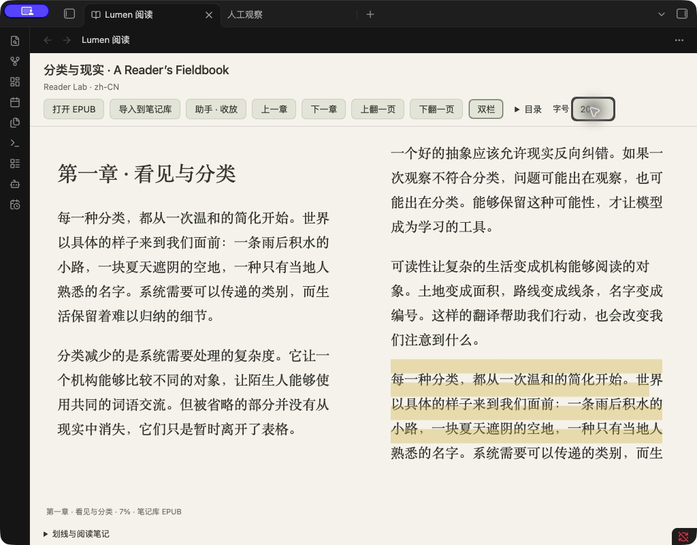

# Lumen 5.8.4 — 阅读、笔记与 AI / Reading, notes and AI

[中文](#中文) · [English](#english) · [下载 / Download](https://github.com/leoyang1984/lumen-public/releases/tag/v5.8.4) · [完整指南 / Guide](docs/READING_GUIDE.md)

Lumen 在 Obsidian 中提供 EPUB 阅读、AI 对话、笔记整理和白板工作流。你可以使用 API，也可以调用电脑上已安装的 Codex 或 pi，不需要一直打开终端窗口。

Lumen brings EPUB reading, AI chat, note organization and Canvas workflows into Obsidian. Use an API provider or an installed local Codex/pi CLI without keeping a terminal window open.

*阅读界面示例，来自前版原创样书验收；当前工具栏已调整。 / Reading example from an earlier original-material acceptance run; the current toolbar has changed.*

## 中文

### 5.8.4 更新了什么？

- **更自然的对话界面**：输入框底部只有一排操作；联网直接可见，生图、Skill 和扩展放入工具菜单。历史、新对话、更多操作分清用途；诊断日志不再混在历史旁边。
- **联网开一次，连续使用**：设置和输入框控制同一个开关。发送、追问、新对话和重启后仍保留，直到自行关闭。开启表示允许按需搜索，不强制每次搜索；生图仍需明确要求，Skill 和扩展的显式选择仍按消息使用。
- **设置按任务分组**：连接、助手能力、API 服务、阅读与保存、白板与自动化、高级与诊断、关于，每次只显示一组。
- **API 配置集中管理**：文字模型、图片识别、API 生图默认折叠，显示已配置／未配置／未启用。“已配置”表示必要字段已填写，不代表连接测试成功。
- **阅读与保存更清楚**：展开查看正在讨论的选文；区分原话和 AI 草稿；保存前可编辑并查看目标位置。已保存结果直接打开笔记，避免重复保存；无法发送时保留输入并提供解决入口。
- **无需订阅或激活码**：取消员工数量和付费功能门槛。模型费用由你的服务商或 CLI 账号决定；预算、文件权限、写入预览确认和撤销仍保留。

### 可以做什么？

| 场景 | 功能 |
| --- | --- |
| 读电子书 | 无 DRM、可重排 EPUB；目录、单／双栏、方向键、同章翻页、阅读位置恢复 |
| 边读边聊 | API / Codex / pi 对话、连续追问、人工笔记检索、带出处的笔记与原文回跳 |
| 使用本机能力 | Codex 搜索、可信独立指令型 Skill、兼容 Pi 工具扩展、明确请求的 Codex 原生生图 |
| 整理笔记 | 原话保存、AI 草稿编辑确认、历史与导出、受控修改与撤销 |
| 白板思考 | Canvas 算子与连线、文字／图片工作流、API 图片生成和编辑 |
| 自动任务 | 员工定义、技能与知识边界、手动／文件监控／定时触发、预算及运行记录 |

CLI 对话不需要额外配置 MCP。白板、员工等原有 API 功能仍使用“API 服务”中的模型配置，并不会自动改用 CLI。

### 安装和升级

**BRAT**：安装 Obsidian 42 - BRAT → Add Beta plugin → 输入 `leoyang1984/lumen-public` → 启用 Lumen。已有用户在 BRAT 中检查更新。

**手动安装**：从 [5.8.4 Release](https://github.com/leoyang1984/lumen-public/releases/tag/v5.8.4) 下载 ZIP 或三个运行文件，将 `main.js`、`manifest.json`、`styles.css` 放入笔记库的 `.obsidian/plugins/lumen/`，然后启用插件。ZIP 还包含指南与第三方声明；只需复制三个运行文件。

**升级先备份，只替换三个运行文件**。保留 `data.json`、阅读状态和历史，重载 Lumen 或重开 Obsidian。首次升级到 5.8.4，所有已有自主员工（包括此前正在使用的员工）会保持暂停；请在“白板与自动化”检查配置并逐个确认恢复，避免取消授权后突然开始任务。新员工默认关闭自主工作。

### 条件与已知范围

- EPUB 可离线阅读；AI 需要 API 配置，或已安装、配置并登录的 Codex CLI / pi。CLI 原生能力需要桌面 Obsidian，并要求模型与账号支持相应能力。
- 前序实测环境：macOS、Obsidian 1.14.4、Codex CLI 0.160.1、pi 1.1.0。这些是验证记录，不是强制锁定版本。其他系统、实体移动设备和所有服务商组合未完整实测。
- Codex 搜索需要联网。Pi 搜索还需要自行安装、选中并启用兼容的搜索扩展；Lumen 不内置通用 Pi 搜索扩展，第三方推荐与兼容性评估仍待完成。
- Pi 扩展运行可信本机代码，不是沙箱；扩展自己写文件不保证经过 Lumen 笔记确认。复杂 Skill、纯终端交互扩展和任意扩展不保证兼容。
- 原生 Codex 图片目前支持 PNG 生成，不含原生编辑；API 图片生成／编辑是独立功能。未发送输入不保证跨插件重载恢复。
- 5.8.4 已通过类型检查、生产构建和分发隐私检查。此前阅读与保存改动有集中验收记录；本轮 API 页面、取消激活及自主任务升级迁移尚未完成桌面验收。

[中英文更新说明](docs/RELEASE_NOTES_5.8.4.md) · [使用指南](docs/READING_GUIDE.md) · [运行时工作流教程](runtime-workflow-pack/) · [分发协议](COMMERCIAL_LICENSE.md) · [第三方声明](docs/THIRD_PARTY_NOTICES.txt)

## English

### What changed in 5.8.4?

- **A clearer chat layout**: one composer toolbar. Search stays visible; images, Skills and extensions use the tools menu. History, new chat and more actions have distinct roles. Diagnostic logs are separate from conversation history.
- **Persistent search permission**: settings and the composer share one switch. It survives messages, follow-ups, new conversations and reopening until you turn it off. Search is available as needed, not mandatory for every answer. Images need explicit requests; explicit Skill and extension selections remain per-message.
- **Settings by task**: Connection, Assistant capabilities, API services, Reading and saving, Canvas and automation, Advanced and diagnostics, and About. Only one group is shown at a time.
- **API services together**: collapsed text, image-understanding and API image sections show configuration state. “Configured” means required fields are filled, not that a connection test passed.
- **Clear reading and saving**: inspect the pinned passage, distinguish your words from AI drafts, edit before saving, and see the destination. Saved results open their existing note. Blocked sends keep your input and offer a next action.
- **No subscription activation**: no activation code or paid/count gate for employees. Provider/CLI charges, budgets, file permissions, write confirmation and undo still apply.

### Main features

Read DRM-free reflowable EPUBs with contents, single/two columns, keyboard navigation and restored positions. Discuss passages through API/Codex/pi, retrieve human notes, confirm source-linked Markdown and return to the passage. Use Codex search, trusted self-contained instruction Skills, compatible Pi tool extensions and explicitly requested native Codex images. Canvas operators support visual text/image workflows; employees support bounded knowledge, triggers, budgets and run records.

CLI chat does not require extra MCP setup. Existing Canvas and employee API features keep using API services; they do not automatically switch to a CLI.

### Install and upgrade

**BRAT**: install Obsidian 42 - BRAT, choose Add Beta plugin, enter `leoyang1984/lumen-public`, then enable Lumen. Existing BRAT users can check for updates.

**Manual**: download the [5.8.4 release](https://github.com/leoyang1984/lumen-public/releases/tag/v5.8.4). Copy only `main.js`, `manifest.json`, `styles.css` into `.obsidian/plugins/lumen/` in your Vault and enable the plugin. The ZIP also includes the guide and third-party notices.

Back up first. Replace only the three runtime files; keep settings, reading state and history. Reload Lumen or reopen Obsidian. All existing autonomous employees, including previously active ones, stay paused on the first 5.8.4 upgrade. Review and confirm them under Canvas and automation before resuming. New employees retain opt-in autonomy.

### Requirements and limits

Reading works offline. AI needs a configured API or installed/configured/signed-in Codex CLI/pi. Native CLI capabilities require desktop Obsidian and a suitable model/account. Earlier acceptance used macOS, Obsidian 1.14.4, Codex CLI 0.160.1 and pi 1.1.0; these are tested versions, not exact version locks. Other OS/device/provider combinations are not fully verified.

Pi web search needs an installed, selected and enabled compatible extension. Lumen does not bundle a general Pi search provider; third-party recommendations remain pending. Extensions run trusted local code, not a sandbox; their direct writes can bypass Lumen note confirmation. Complex Skills and terminal-only or arbitrary extensions are not guaranteed. Native Codex images currently support PNG generation, not native editing; API image generation/editing is separate. Unsent input may not survive reload.

5.8.4 passed TypeScript, production build and distribution privacy checks. Earlier reading/save refinements have focused acceptance evidence. The latest API page, activation removal and automatic-task upgrade migration have not completed desktop acceptance.

[Release notes](docs/RELEASE_NOTES_5.8.4.md) · [Guide](docs/READING_GUIDE.md) · [Workflow tutorials](runtime-workflow-pack/) · [Distribution terms](COMMERCIAL_LICENSE.md) · [Third-party notices](docs/THIRD_PARTY_NOTICES.txt)
