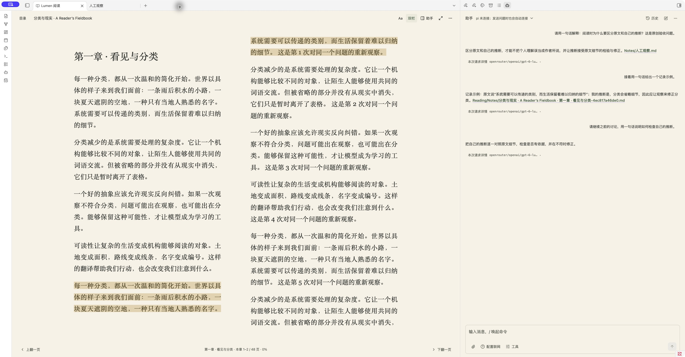

# Lumen 5.8.10 — 阅读、笔记与 AI / Reading, notes and AI

[中文](#中文) · [English](#english) · [下载 / Download](https://github.com/leoyang1984/lumen-public/releases/tag/v5.8.10) · [完整指南 / Guide](docs/READING_GUIDE.md)

Lumen 在 Obsidian 中提供 EPUB 阅读、AI 对话、笔记整理和白板工作流。你可以使用 API，也可以调用电脑上已安装的 Codex 或 pi，不需要一直打开终端窗口。

Lumen brings EPUB reading, AI chat, note organization and Canvas workflows into Obsidian. Use an API provider or an installed local Codex/pi CLI without keeping a terminal window open.

*Lumen 5.8.10 实际界面：双栏阅读、划线与右侧助手，统一纸色和对齐的简洁顶栏。书籍与对话来自原创测试材料；右侧展示已恢复的历史对话。 / Actual Lumen 5.8.10 interface: two-column reading, highlights and a companion panel, with a shared paper background and aligned, minimal toolbars. The book and conversation use original test material; the panel shows restored chat history.*

## 中文

### 5.8.10 更新了什么？

**安静的书页，同屏的助手。** 阅读器、外围留白和助手采用当前书页底色；顶栏对齐，连接状态收进助手顶栏，输入框沿用纸色。去掉书页阴影与中缝渐变，左右比例仍由你拖动调整。

- **简洁导航**：目录、书名、Aa、单／双栏、助手、专注与更多集中在顶部；翻页和阅读进度在底部。重复的 Obsidian 标题栏与正文、翻页按钮悬停提示已去掉。
- **排版集中调整**：Aa 提供暖纸、纸白、夜读主题，以及字体、字号、行距、页边留白与沿用书籍排版。外观随阅读标签页保存，不修改 EPUB。
- **专注阅读**：隐藏阅读器工具栏，保留轻量进度和退出入口；鼠标靠近顶部或通过键盘导航可唤出控件。
- **跨章连续翻页**：单／双栏的翻页按钮与 PageUp／PageDown 继续到下一章，反向返回上一章末尾；双栏滚轮也支持。全书首尾不循环。上下键仍在同章内移动，左右键翻章。
- **助手融入书页**：阅读时与书页同色，切回普通笔记后恢复常规样式；空对话中的长书名改为低调的一行。选文提问、引用和保存逻辑继续沿用。

本轮类型检查与生产构建通过，本地使用者已确认整体视觉效果。未新增自动化测试；三主题、多窗口宽度、特殊 EPUB、连接与恢复流程的全面回归仍待完成。前序测试记录见下方，不能替代本轮验收。

### 保存位置（延续 5.8.5）

**保存在哪里，由你决定。** 在“设置 → Lumen → 阅读与保存 → 保存位置”集中设置书籍、笔记、图片和对话的目录。默认设置可以直接使用，也可以选择已有文件夹、填写新文件夹，或明确选择笔记库根目录。

- 所有路径相对于当前笔记库。例如笔记库叫 A，填写 `B/笔记`，文件就保存到 A 内的 B/笔记；无需填写电脑绝对路径。
- 点击“应用”才生效；每项可恢复默认。新文件夹在实际保存时创建。空的自定义目录、越界路径、内部目录及文件冲突会提示错误。
- 修改位置只影响新文件，不搬动已有书籍、笔记或图片。旧 API 图片目录继续沿用，旧文件与原文回跳保持原记录。
- 保存确认显示目标位置；全局设置变化不会改变已打开确认窗口的目标。失败保留草稿或预览，不覆盖同名文件。
- 阅读笔记可单次另选目录或追加已有笔记；对话导出默认集中到 `Reading/Conversations`，旧导出保持原样。

| 保存内容 | 默认目录 |
| --- | --- |
| 导入 EPUB | `Reading/Books` |
| 阅读笔记与确认想法 | `Reading/Notes` |
| Codex 原生图片 | `attachments/lumen-generated` |
| 图片说明笔记 | `Reading/Images` |
| 粘贴／上传图片 | `attachments/lumen-input-images` |
| API 图片 | `attachments/ai-gen` |
| 导出对话 | `Reading/Conversations` |

图片说明笔记、上传图片和 API 图片目录在“高级保存位置”中展开。内部历史、缓存、阅读关联和撤销数据的位置固定。详见[保存位置指南](docs/READING_GUIDE.md)。

### 延续的界面与交互改进

- **更自然的对话界面**：输入框底部只有一排操作；联网直接可见，生图、Skill 和扩展放入工具菜单。历史、新对话、更多操作分清用途；诊断日志不再混在历史旁边。
- **联网开一次，连续使用**：设置和输入框控制同一个开关。发送、追问、新对话和重启后仍保留，直到自行关闭。开启表示允许按需搜索，不强制每次搜索；生图仍需明确要求，Skill 和扩展的显式选择仍按消息使用。
- **设置按任务分组**：连接、助手能力、API 服务、阅读与保存、白板与自动化、高级与诊断、关于，每次只显示一组。
- **API 配置集中管理**：文字模型、图片识别、API 生图默认折叠，显示已配置／未配置／未启用。“已配置”表示必要字段已填写，不代表连接测试成功。
- **阅读与保存更清楚**：展开查看正在讨论的选文；区分原话和 AI 草稿；保存前可编辑并查看目标位置。已保存结果直接打开笔记，避免重复保存；无法发送时保留输入并提供解决入口。
- **无需订阅或激活码**：取消员工数量和付费功能门槛。模型费用由你的服务商或 CLI 账号决定；预算、文件权限、写入预览确认和撤销仍保留。

### 可以做什么？

| 场景 | 功能 |
| --- | --- |
| 读电子书 | 无 DRM、可重排 EPUB；目录、单／双栏、主题与排版、专注模式、方向键、跨章连续翻页、阅读位置恢复 |
| 边读边聊 | API / Codex / pi 对话、连续追问、人工笔记检索、带出处的笔记与原文回跳 |
| 使用本机能力 | Codex 搜索、可信独立指令型 Skill、兼容 Pi 工具扩展、明确请求的 Codex 原生生图 |
| 整理笔记 | 原话保存、AI 草稿编辑确认、历史与导出、受控修改与撤销 |
| 白板思考 | Canvas 算子与连线、文字／图片工作流、API 图片生成和编辑 |
| 自动任务 | 员工定义、技能与知识边界、手动／文件监控／定时触发、预算及运行记录 |

CLI 对话不需要额外配置 MCP。白板、员工等原有 API 功能仍使用“API 服务”中的模型配置，并不会自动改用 CLI。

### 安装和升级

**BRAT**：安装 Obsidian 42 - BRAT → Add Beta plugin → 输入 `leoyang1984/lumen-public` → 启用 Lumen。已有用户在 BRAT 中检查更新。

**手动安装**：从 [5.8.10 Release](https://github.com/leoyang1984/lumen-public/releases/tag/v5.8.10) 下载三个运行文件，将 `main.js`、`manifest.json`、`styles.css` 放入笔记库的 `.obsidian/plugins/lumen/`，然后启用插件。指南与第三方声明放在本仓库文档中，无需复制到插件目录。

**升级先备份，只替换三个运行文件**。保留 `data.json`、阅读状态和历史，重载 Lumen 或重开 Obsidian。从 5.8.4 之前的版本首次升级时，所有已有自主员工（包括此前正在使用的员工）会保持暂停；请在“白板与自动化”检查配置并逐个确认恢复，避免取消授权后突然开始任务。新员工默认关闭自主工作。

### 条件与已知范围

- EPUB 可离线阅读；AI 需要 API 配置，或已安装、配置并登录的 Codex CLI / pi。CLI 原生能力需要桌面 Obsidian，并要求模型与账号支持相应能力。
- 前序实测环境：macOS、Obsidian 1.14.4、Codex CLI 0.160.1、pi 1.1.0。这些是验证记录，不是强制锁定版本。其他系统、实体移动设备和所有服务商组合未完整实测。
- Codex 搜索需要联网。Pi 搜索还需要自行安装、选中并启用兼容的搜索扩展；Lumen 不内置通用 Pi 搜索扩展，第三方推荐与兼容性评估仍待完成。
- Pi 扩展运行可信本机代码，不是沙箱；扩展自己写文件不保证经过 Lumen 笔记确认。复杂 Skill、纯终端交互扩展和任意扩展不保证兼容。
- 原生 Codex 图片目前支持 PNG 生成，不含原生编辑；API 图片生成／编辑是独立功能。未发送输入不保证跨插件重载恢复。
- 5.8.5 已通过 36 个自动回归入口、10 项本机协议测试、类型检查、生产构建和打包。独立 macOS 测试库走通保存位置配置与恢复、原创 EPUB 导入、原话保存、真实 Pi 回答确认、对话导出和引用回跳。API 图片路由与原生 PNG 存储使用原创模拟数据；本轮未覆盖所有真实生图服务、其他系统及自主任务升级迁移。

[中英文更新说明](docs/RELEASE_NOTES_5.8.10.md) · [使用指南](docs/READING_GUIDE.md) · [运行时工作流教程](runtime-workflow-pack/) · [分发协议](COMMERCIAL_LICENSE.md) · [第三方声明](docs/THIRD_PARTY_NOTICES.txt)

## English

### What changed in 5.8.10?

**Quiet pages with a companion assistant.** Reading, surrounding space and chat use the current paper background. Toolbars align; connection status sits inside the chat toolbar. The input uses paper color. Page shadows and gutter shading are removed, while pane widths remain under your control.

- **Simpler navigation**: Contents, book title, Aa, layout, Assistant, Focus and More in the header; paging and progress in the footer. Remove the redundant Obsidian view header and repeated reading/page hover hints.
- **Typography together**: Aa provides Warm/Paper/Night, font, size, line height, margins and publisher typography. Preferences follow the reading tab without changing EPUB bytes.
- **Focus reading**: hide reader toolbars, keeping lightweight progress and an exit. Reveal controls near the top edge or through keyboard navigation.
- **Continuous chapter paging**: page buttons and PageUp/PageDown continue across chapters in either layout; backward paging opens the previous chapter’s end. Two-column wheel paging also continues. Book ends do not wrap. Up/down remain chapter-local; left/right change chapters.
- **Companion chat**: chat follows paper color while reading and returns to its usual appearance with ordinary notes. Empty chat shows long book titles on one quiet line. Passage context, citations and saving keep their existing behavior.

TypeScript checking and production building passed; a local user confirmed the overall appearance. No new automated tests were run. Full regression across themes, widths, unusual EPUBs, connections and recovery remains pending. Earlier tests below do not certify the new UI.

### Save locations (retained from 5.8.5)

**Choose where your files go.** Seven save locations are grouped under **Settings → Lumen → Reading and saving → Save locations**. Defaults work without setup. Pick an existing folder, type a new folder, or explicitly choose Vault root.

- Paths are relative to your current Vault: `B/Notes` means that folder inside the Vault, not an absolute computer path.
- Choose a mode and click **Apply**. Reset each location independently. Folders are created on actual saves. Empty custom paths, paths outside the Vault, internal folders and file conflicts are reported.
- Changes affect new files only. Existing books, notes and images keep their locations and source links. Existing API image folders are retained.
- Save confirmations show their destination and retain it even if global settings change. Failed saves keep drafts/previews; filename conflicts never overwrite existing files.
- Reading notes can choose a different folder for one save or append to a note. Conversation exports default to `Reading/Conversations`; old exports remain in place.

| Content | Default folder |
| --- | --- |
| Imported EPUBs | `Reading/Books` |
| Reading notes and confirmed ideas | `Reading/Notes` |
| Native Codex images | `attachments/lumen-generated` |
| Image notes | `Reading/Images` |
| Pasted/uploaded images | `attachments/lumen-input-images` |
| API images | `attachments/ai-gen` |
| Conversation exports | `Reading/Conversations` |

Image notes, uploads and API images are under **Advanced locations**. Internal history, caches, reading metadata and undo storage remain fixed. See the [save locations guide](docs/READING_GUIDE.md).

### Existing UI and interaction improvements

- **A clearer chat layout**: one composer toolbar. Search stays visible; images, Skills and extensions use the tools menu. History, new chat and more actions have distinct roles. Diagnostic logs are separate from conversation history.
- **Persistent search permission**: settings and the composer share one switch. It survives messages, follow-ups, new conversations and reopening until you turn it off. Search is available as needed, not mandatory for every answer. Images need explicit requests; explicit Skill and extension selections remain per-message.
- **Settings by task**: Connection, Assistant capabilities, API services, Reading and saving, Canvas and automation, Advanced and diagnostics, and About. Only one group is shown at a time.
- **API services together**: collapsed text, image-understanding and API image sections show configuration state. “Configured” means required fields are filled, not that a connection test passed.
- **Clear reading and saving**: inspect the pinned passage, distinguish your words from AI drafts, edit before saving, and see the destination. Saved results open their existing note. Blocked sends keep your input and offer a next action.
- **No subscription activation**: no activation code or paid/count gate for employees. Provider/CLI charges, budgets, file permissions, write confirmation and undo still apply.

### Main features

Read DRM-free reflowable EPUBs with contents, single/two columns, themes, typography, focus mode, continuous chapter paging, keyboard navigation and restored positions. Discuss passages through API/Codex/pi, retrieve human notes, confirm source-linked Markdown and return to the passage. Use Codex search, trusted self-contained instruction Skills, compatible Pi tool extensions and explicitly requested native Codex images. Canvas operators support visual text/image workflows; employees support bounded knowledge, triggers, budgets and run records.

CLI chat does not require extra MCP setup. Existing Canvas and employee API features keep using API services; they do not automatically switch to a CLI.

### Install and upgrade

**BRAT**: install Obsidian 42 - BRAT, choose Add Beta plugin, enter `leoyang1984/lumen-public`, then enable Lumen. Existing BRAT users can check for updates.

**Manual**: download the [5.8.10 release](https://github.com/leoyang1984/lumen-public/releases/tag/v5.8.10). Copy only `main.js`, `manifest.json`, `styles.css` into `.obsidian/plugins/lumen/` in your Vault and enable the plugin. The guide and third-party notices are in this repository; they are not installation files.

Back up first. Replace only the three runtime files; keep settings, reading state and history. Reload Lumen or reopen Obsidian. All existing autonomous employees, including previously active ones, stay paused when first upgrading from a version before 5.8.4. Review and confirm them under Canvas and automation before resuming. New employees retain opt-in autonomy.

### Requirements and limits

Reading works offline. AI needs a configured API or installed/configured/signed-in Codex CLI/pi. Native CLI capabilities require desktop Obsidian and a suitable model/account. Earlier acceptance used macOS, Obsidian 1.14.4, Codex CLI 0.160.1 and pi 1.1.0; these are tested versions, not exact version locks. Other OS/device/provider combinations are not fully verified.

Pi web search needs an installed, selected and enabled compatible extension. Lumen does not bundle a general Pi search provider; third-party recommendations remain pending. Extensions run trusted local code, not a sandbox; their direct writes can bypass Lumen note confirmation. Complex Skills and terminal-only or arbitrary extensions are not guaranteed. Native Codex images currently support PNG generation, not native editing; API image generation/editing is separate. Unsent input may not survive reload.

5.8.5 passed 36 regression entry points, 10 local-agent protocol tests, TypeScript, production build and packaging. An isolated macOS Vault covered save settings and reload, original EPUB import, your words, a live Pi answer, confirmed notes, export and source return. API image routes and native PNG storage used original deterministic fixtures. All live image providers, other platforms and autonomous-task upgrade migration are outside this verification.

[Release notes](docs/RELEASE_NOTES_5.8.10.md) · [Guide](docs/READING_GUIDE.md) · [Workflow tutorials](runtime-workflow-pack/) · [Distribution terms](COMMERCIAL_LICENSE.md) · [Third-party notices](docs/THIRD_PARTY_NOTICES.txt)
